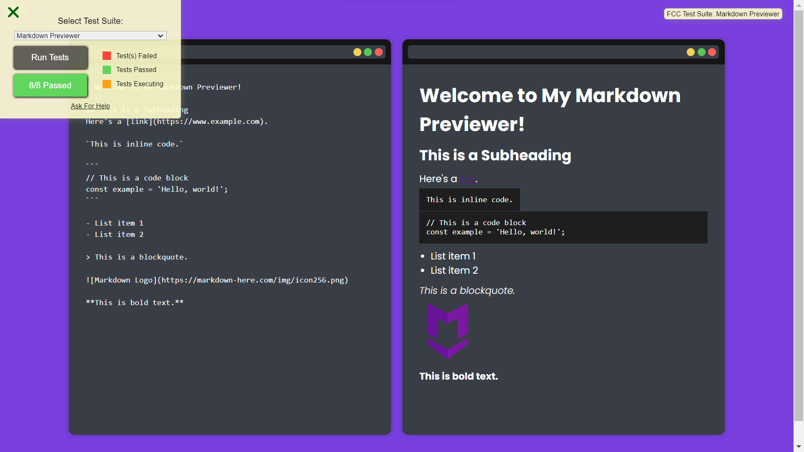

# Markdown Previewer

This is a project developed as part of the FreeCodeCamp certification. The aim of this project is to create an application that allows writing in markdown and viewing HTML and meets the following user story criteria:

## User Stories

1. User Story #1: I can see a textarea element with a corresponding id="editor".
2. User Story #2: I can see an element with a corresponding id="preview".
3. User Story #3: When I enter text into the #editor element, the #preview element is updated as I type to display the content of the textarea.
4. User Story #4: When I enter GitHub flavored markdown into the #editor element, the text is rendered as HTML in the #preview element as I type (HINT: You don't need to parse Markdown yourself - you can import the Marked library for this: https://cdnjs.com/libraries/marked).
5. User Story #5: When my markdown previewer first loads, the default text in the #editor field should contain valid markdown that represents at least one of each of the following elements: a heading element (H1 size), a sub heading element (H2 size), a link, inline code, a code block, a list item, a blockquote, an image, and bolded text.
6. User Story #6: When my markdown previewer first loads, the default markdown in the #editor field should be rendered as HTML in the #preview element.

**Optional Bonus** (you do not need to make this test pass): My markdown previewer interprets carriage returns and renders them as br (line break) elements.

## Additional Features

1. **Line Break**: My markdown previewer interprets carriage returns and renders them as   elements.

## Technologies Used

- React
- CSS Modules
- JavaScript

## How to Run the Project

You can run the project by following this link: [Project Link](https://freecodecamp-markdown-previewer-eight.vercel.app/)

I hope you enjoy the experience of me Markdown Previewer!
